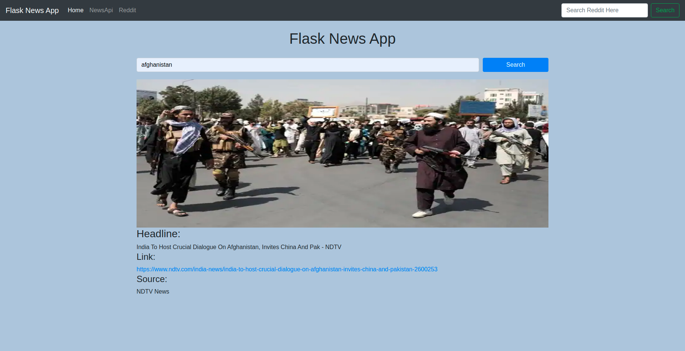

# FlaskNewsApp

 Clone the repository by typing ***"git clone https://github.com/zubairwazir/FlaskNewsApp.git"***

 Open Terminal/Command Prompt

Open the Cloned Repository Folder

Create Virtual Environment by typing ***"python -m venv env_name"***

Activate Virtual Environment by typing ***"source/env_name/bin/activate"*** for **mac**

Activate Virtual Environment by typing ***"source/env_name/Scripts/activate"*** for **bash**

Activate Virtual Environment by typing ***".env_name\Scripts\activate"*** for **windows**

After Activating Virtual EnvironmenT install the reqired modules by typing ***"pip install -r requirements.txt"***

when requirements installed, open the app by typing ***"python app.py"***

Open browser and paste the link ***"127.0.0.1:5000"***

## Buraaaah, Enjoy Your Flask News App
